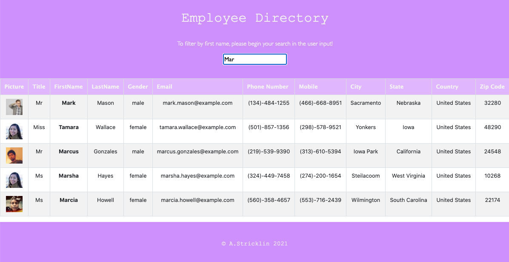

# Employee Directory
MSU - Homework 19: Employee Directory (React)

## Overview
For this project I created an employee directory application using React. This assignment required me to break up my application's UI into components, manage component state, and respond to user events.
The user is able to sort the table by at least one category and filter the users by at least one property.

Given a table of random users generated from the Random User API
when the user loads the page, a table of employees should render.

### Business Context
An employee or manager would benefit greatly from being able to view non-sensitive data about other employees. It would be particularly helpful to be able to filter employees by name.

## Live Demo
* Application deployed to Heroku
[Click here to demo this app.](https://stricklin-employee-directory.herokuapp.com)

### Demo

## Installation
1. git clone
2. npm install
3. Node.js required.

## Usage
1. npm start
Runs the app in the development mode. Open http://localhost:3000 to view it in the browser.

## License
* 

## Built with:
* Node
* React
* React-Bootstrap
* Bootstrap
* Axios
* Random User API
* Heroku